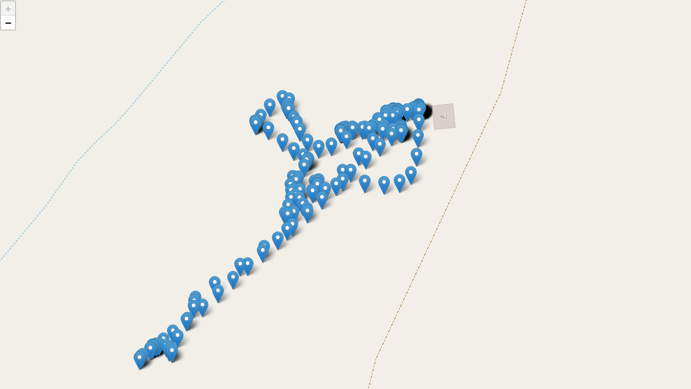

# DJIpyGUI
Visualise drone data from DJI flights, built using `Python 3.12`, with `dearpygui`, `folium` and `pandas`.

## How to use
1. Convert your `.DAT` file to a `.csv` using [DatCon](https://datfile.net/DatCon/downloads.html)
2. If using:
	1. [uv](https://docs.astral.sh/uv/), run `uv sync` then `uv run main.py`
	2. pip, `pip install -r requirements.txt` then `python3 main.py`
3. Open the `.csv` in this program

## Screenshots

